# 👨‍👩‍👧‍👦 Family Coin | Grywalizacja Domowych Obowiązków

<div align="center">
  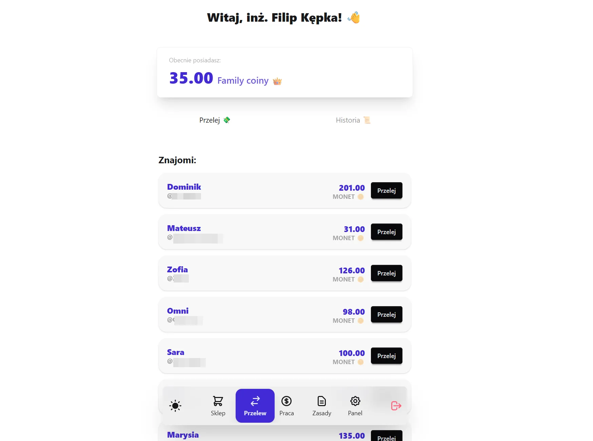
  
  <br />
  <p>
    <b>Nowoczesna aplikacja webowa wprowadzająca domową ekonomię i grywalizację. Wykonywanie obowiązków staje się grą, a dobre nawyki są nagradzane wirtualną walutą, którą można wymienić na realne nagrody!</b>
  </p>
  <p>
    <i>Aplikacja to projekt typu MVP, stworzony z myślą o zabawie i edukacji ekonomicznej dla młodszych kuzynów i kuzynanek. Może służyć jako platforma do domowej gry, gdzie każdy ma swój "pokój" (dom), a administrator pełni rolę "publicznej administracji" nadzorującej zasady i gospodarkę.</i>
  </p>
</div>

---

## 🌍 Live Demo

Aplikacja jest wdrożona i gotowa do przetestowania. Ze względów
bezpieczeństwa, nowo zarejestrowane konta wymagają zatwierdzenia przez
administratora.

- **Link:**
  [https://sevetoo.github.io/family.coin/](https://sevetoo.github.io/family.coin/)

## Demo pokazuje jedynie, że całość działa, ale nie jest to środowisko testowe, więc nie można swobodnie rejestrować nowych kont. Jeśli chcesz zobaczyć aplikację w akcji, skontaktuj się ze mną, a z przyjemnością udostępnię Ci konto testowe!

<div align="center">
  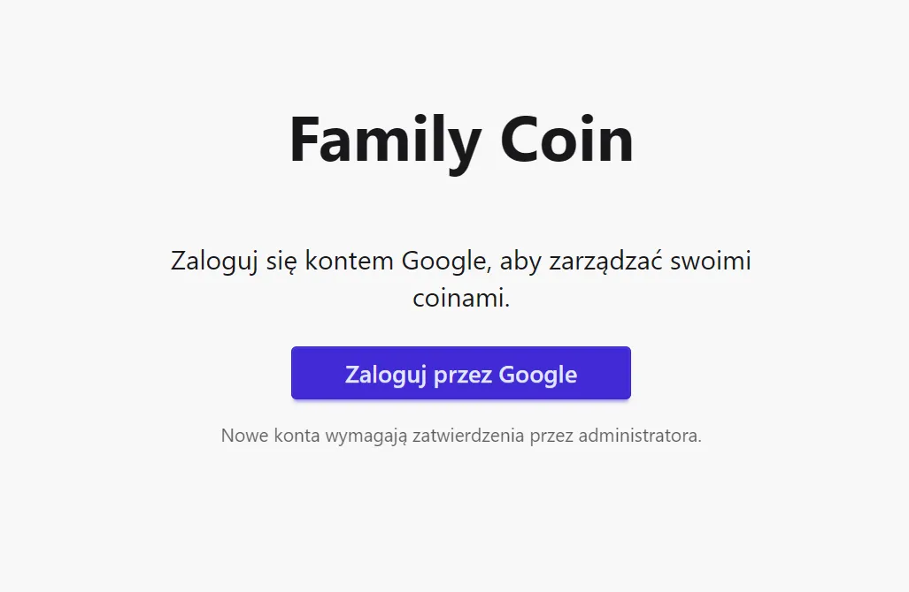
</div>

---

## 💻 Tech Stack

Aplikacja została zbudowana w oparciu o nowoczesny, reaktywny
ekosystem JavaScript, gwarantujący natychmiastową synchronizację stanu
na wielu urządzeniach jednocześnie:

<div align="center">
  
</div>

- **Frontend:** Next.js (App Router), React, TypeScript
- **Styling:** Tailwind CSS, DaisyUI (Gotowe, responsywne komponenty
  UI)
- **Baza danych & Backend:** Firebase (Cloud Firestore NoSQL)
- **Autoryzacja & Pliki:** Firebase Auth (Google Login), Firebase
  Storage (Przechowywanie zdjęć)
- **Formularze:** React Hook Form

---

## 🚀 Kluczowe Funkcjonalności (Showcase)

System został zaprojektowany z myślą o dwóch typach użytkowników:
**Dzieciach/Domownikach** (którzy zarabiają i wydają monety) oraz
**Rodzicach/Adminach** (którzy weryfikują zadania i zarządzają
ekonomią).

### 💰 Zarabianie i Weryfikacja (Moduł Earn)

Użytkownicy mogą wybierać zadania z listy (jednorazowe lub codzienne)
lub zgłaszać własne inicjatywy.

- **Dowody fotograficzne:** Możliwość wgrania zdjęcia potwierdzającego
  posprzątany pokój lub odrobione lekcje.
- **Status "Oczekujące":** Po zgłoszeniu zadania, monety nie są
  przyznawane natychmiast – czekają na akceptację w Panelu Admina.

<div align="center">
  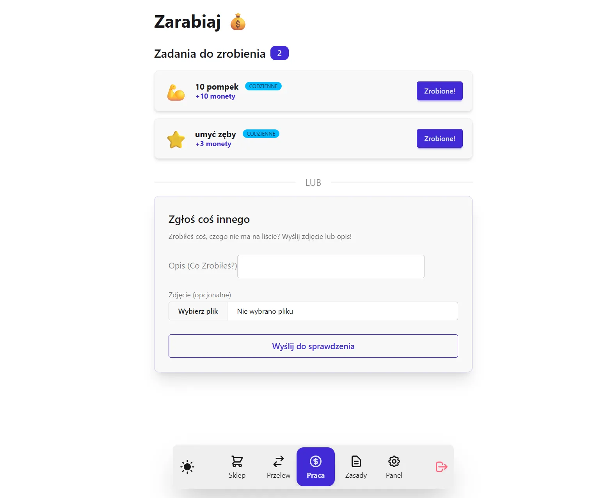
  <p><i>Interaktywna lista zadań z możliwością przesyłania zdjęć z wykonanej pracy.</i></p>
</div>

### 🛒 Interaktywny Sklep z Nagrodami (Shop)

Zarobione _Family Coins_ (FC) można wydać w domowym sklepie na
wirtualne lub fizyczne nagrody (np. "1h grania na komputerze",
"Wyjście do kina").

- **Ochrona salda:** Walidacja blokująca zakup przy niewystarczającej
  liczbie środków.
- **Tryb Edycji Admina:** Rodzic może w locie dodawać nowe przedmioty,
  zmieniać ceny, ukrywać nagrody lub dostosowywać ikony za pomocą
  wbudowanego Emoji Pickera.
- **Historia Zakupów:** Śledzenie własnych wydatków i zakupionych
  nagród.

<div align="center">
  <div style="display: flex; flex-wrap: wrap; justify-content: center; gap: 10px;">
    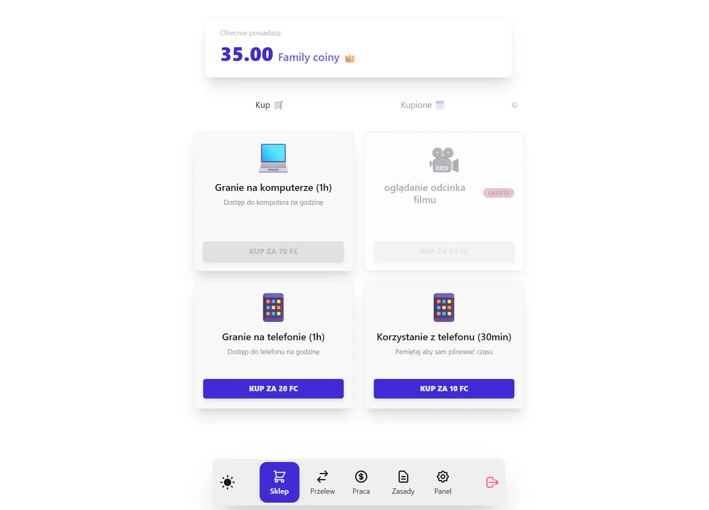
    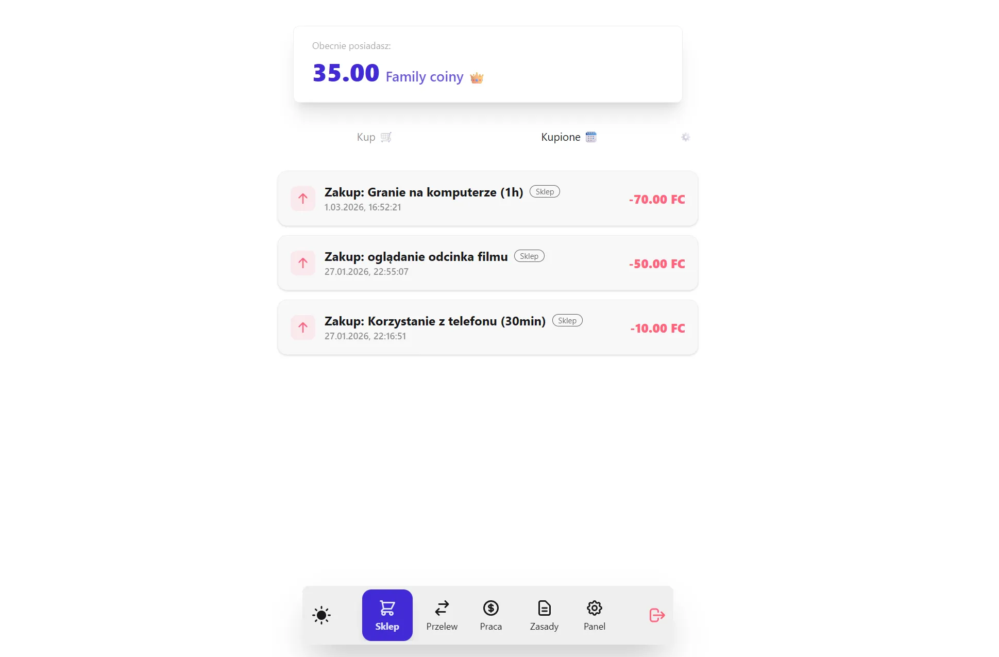
  </div>
  <p><i>Katalog nagród oraz historia transakcji w sklepie.</i></p>
</div>

### 🛡️ Panel Administratora i "Policja"

Centrum dowodzenia dla rodziców. Zawiera wszystko, co potrzebne do
zarządzania systemem:

- **Zatwierdzanie zadań:** Odrzucanie lub akceptowanie dowodów pracy
  (z możliwością modyfikacji kwoty nagrody).
- **Moduł Policji 👮:** Wystawianie "mandatów" z konkretnym powodem
  (np. złamanie regulaminu), które natychmiast obniżają saldo
  ukaranego użytkownika.
- **Zarządzanie Użytkownikami:** Akceptacja nowych kont i nadawanie
  uprawnień.
- **Pełna Edycja:** Sklep, zadania oraz zasady są w pełni edytowalne z
  poziomu admina (dodawanie, usuwanie, zmiana cen i ikon).
- **Historia i Logi:** Pełny wgląd w historię transakcji, zakupów i
  aktywności w systemie.

<div align="center">
  <div style="display: flex; flex-wrap: wrap; justify-content: center; gap: 10px;">
    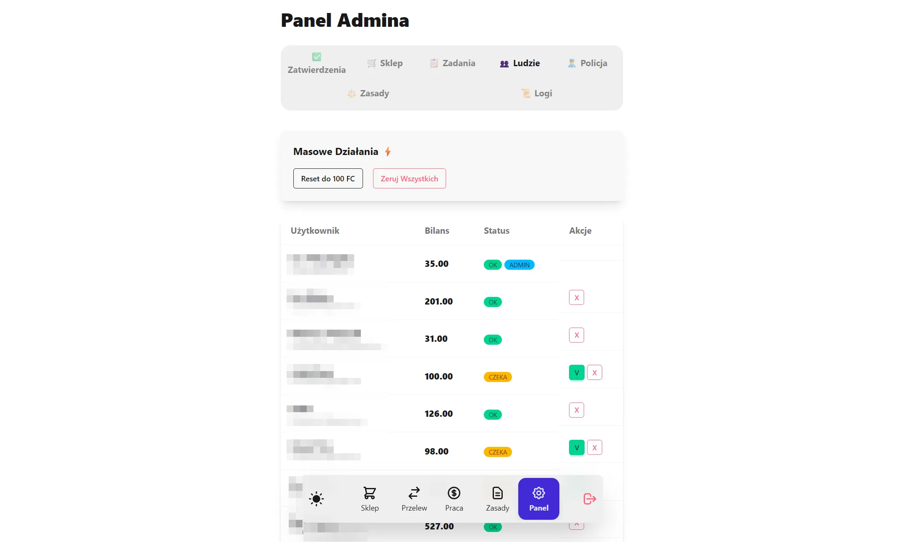
    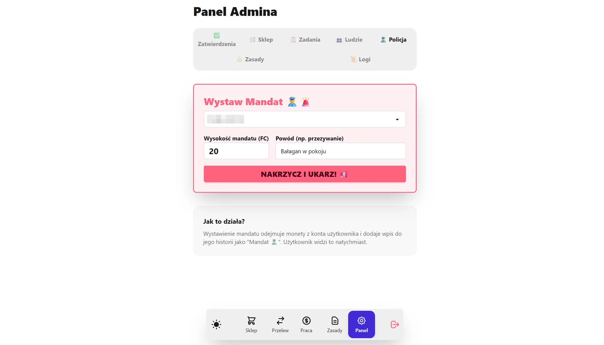
  </div>
  <p><i>Zarządzanie użytkownikami oraz system mandatów.</i></p>
</div>

<div align="center">
  <div style="display: flex; flex-wrap: wrap; justify-content: center; gap: 10px;">
    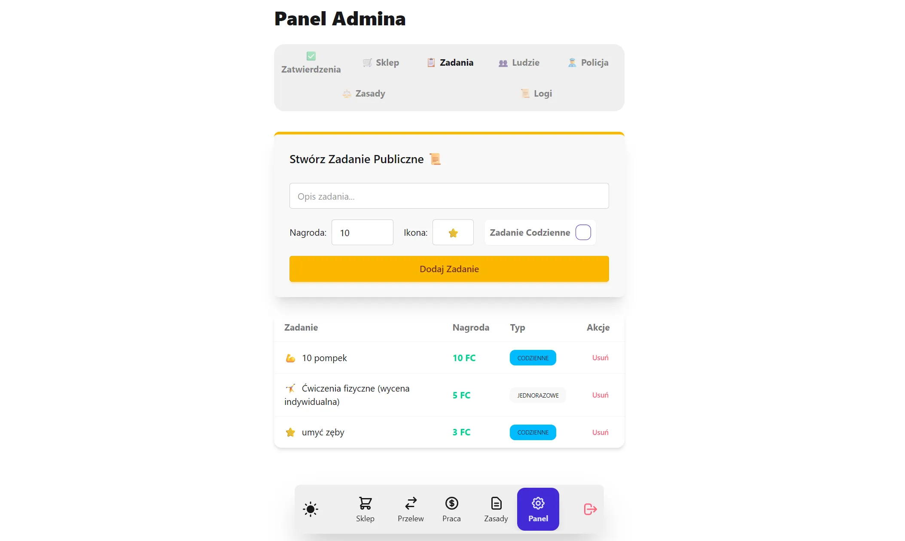
    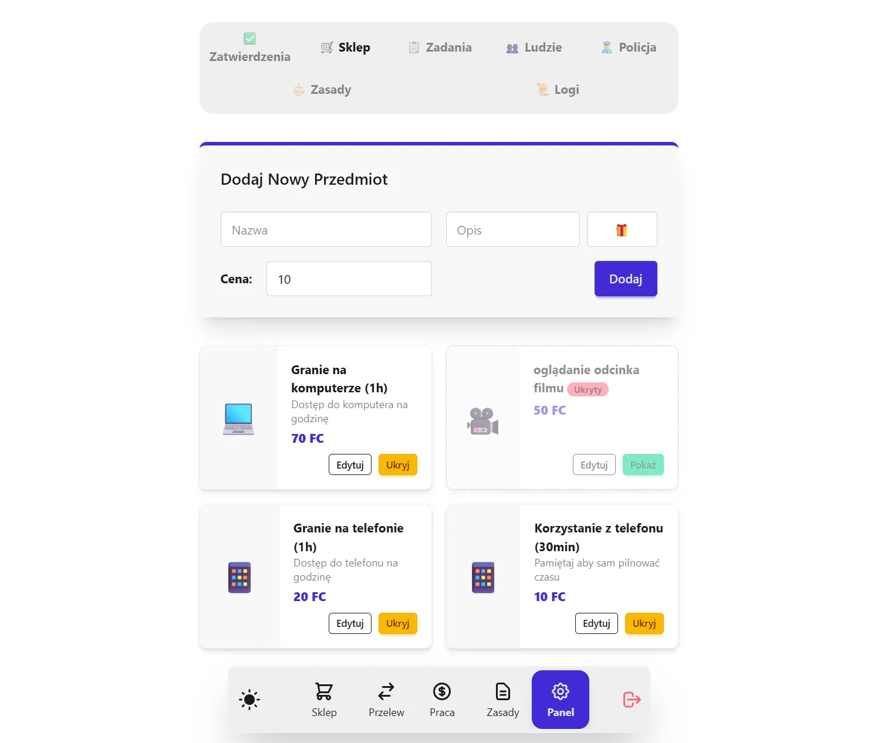
  </div>
  <p><i>Intuicyjna edycja zadań i nagród bezpośrednio z aplikacji.</i></p>
</div>

<div align="center">
  <div style="display: flex; flex-wrap: wrap; justify-content: center; gap: 10px;">
    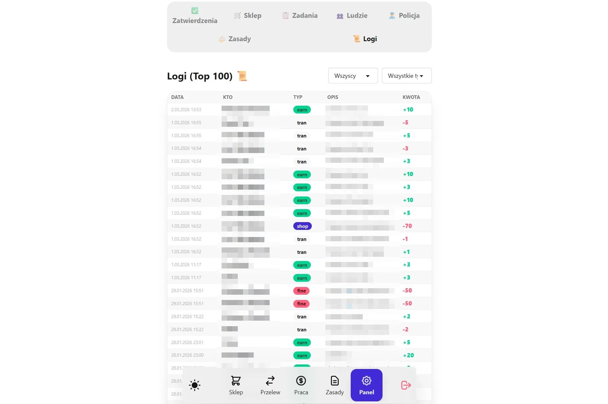
    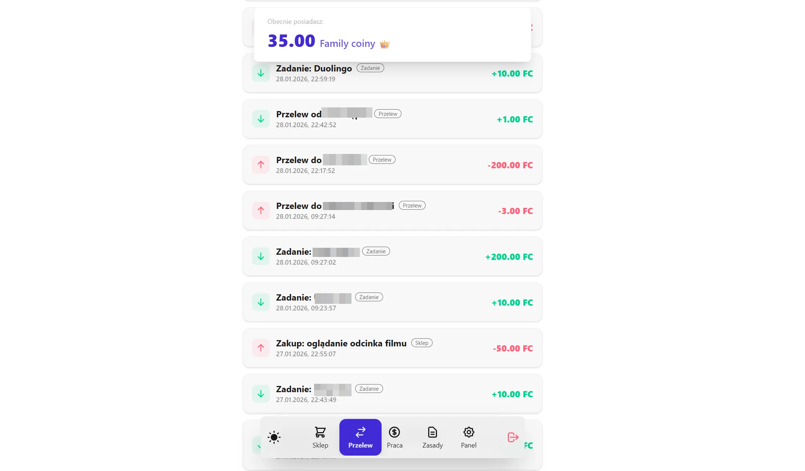
  </div>
  <p><i>Transparentna historia wszystkich operacji w systemie.</i></p>
</div>

### ⚖️ Kodeks Rodzinny i Transparentność

Wbudowana zakładka "Zasady", z której domownicy mogą w każdej chwili
odczytać obowiązujący regulamin i taryfikator kar, aby zasady gry były
zawsze jasne i przejrzyste.

<div align="center">
  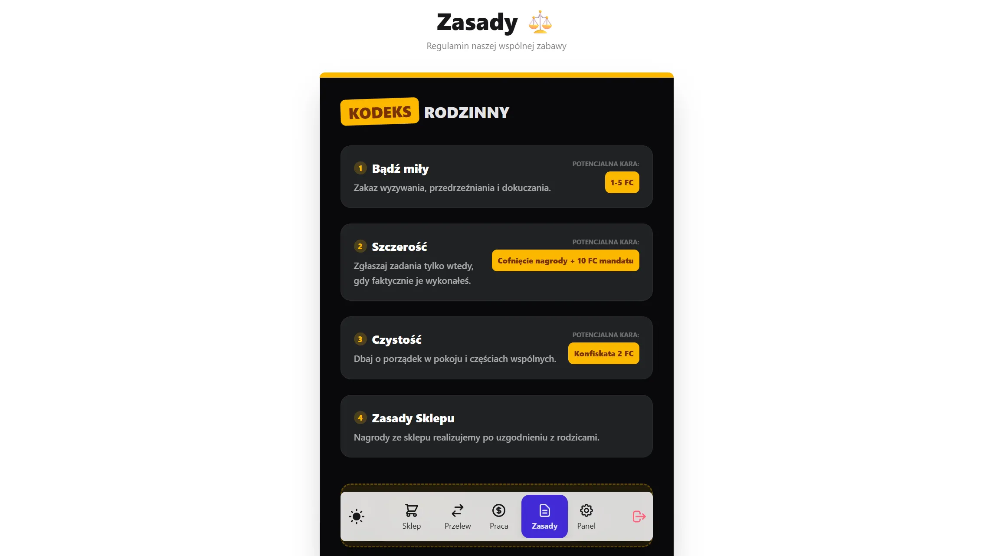
</div>

---

## ⚙️ Architektura Firebase i Bezpieczeństwo

Aplikacja opiera się na bazie danych czasu rzeczywistego, co zapewnia
niesamowity UX:

- **Real-time Listeners (`onSnapshot`):** Jeśli rodzic na swoim
  telefonie zaakceptuje zadanie, saldo na telefonie dziecka
  aktualizuje się w ułamek sekundy bez konieczności odświeżania
  strony.
- **Transakcje atomowe:** Zakupy w sklepie korzystają z
  `runTransaction`, co zapobiega błędom w przypadku jednoczesnych prób
  zakupu przez wielu użytkowników.
- **Izolacja kont:** Logowanie odbywa się przez Google Auth. Nowe
  konto otrzymuje status `isApproved: false` i nie widzi zadań, dopóki
  administrator nie zaakceptuje go w panelu.

---

## 💻 Uruchomienie projektu lokalnie

Rozpocznij pracę z kodem w kilku prostych krokach:

1. **Sklonuj repozytorium:**
   ```bash
   git clone [https://github.com/TwojProfil/family-coin.git](https://github.com/TwojProfil/family-coin.git)
   cd family-coin
   ```

